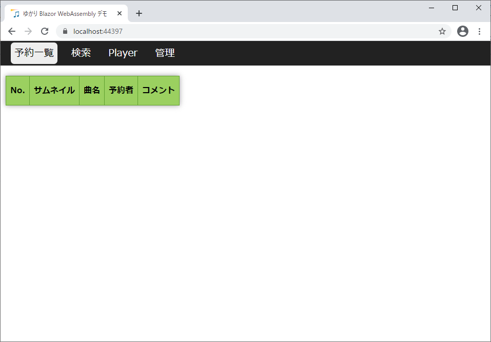
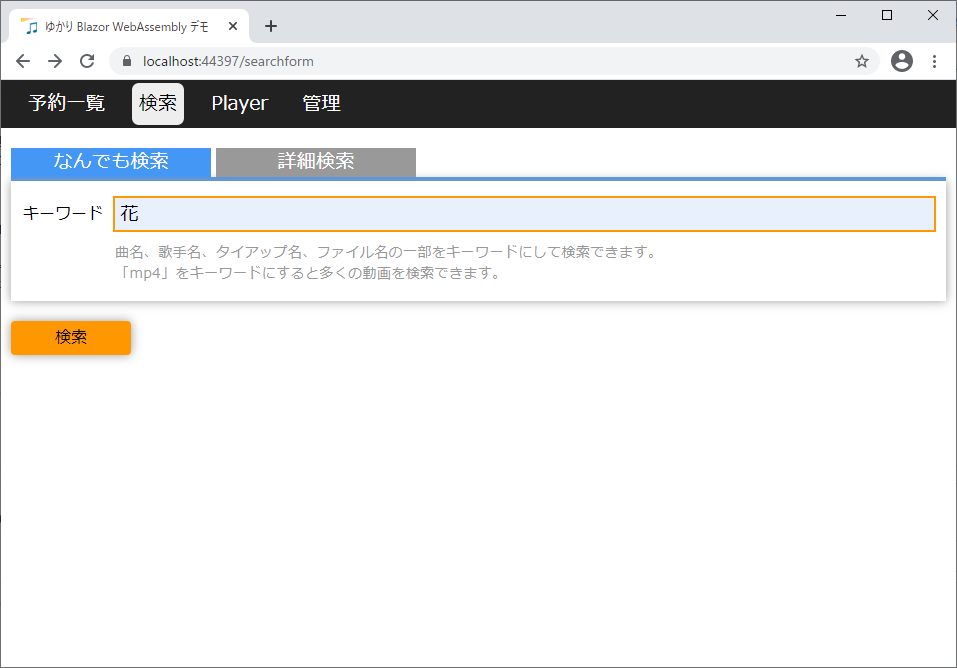
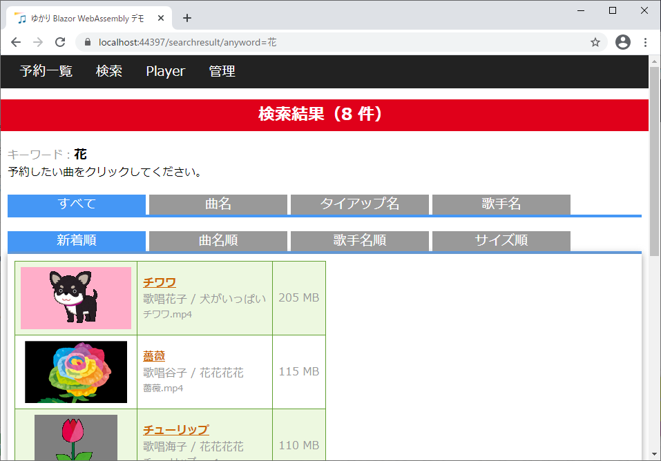
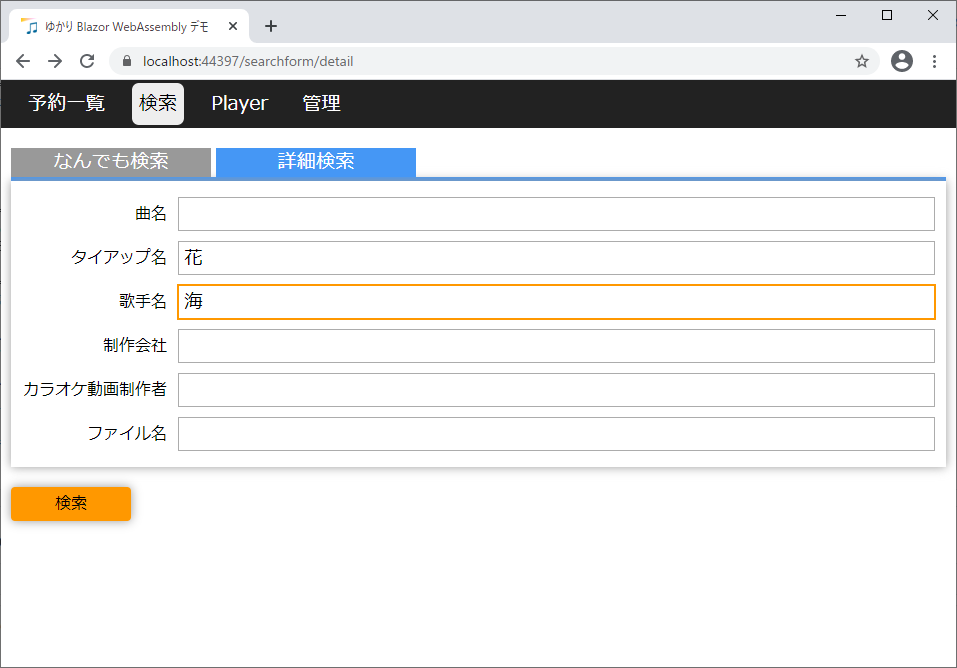
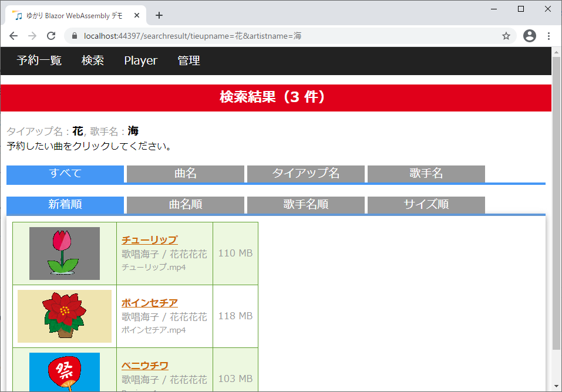
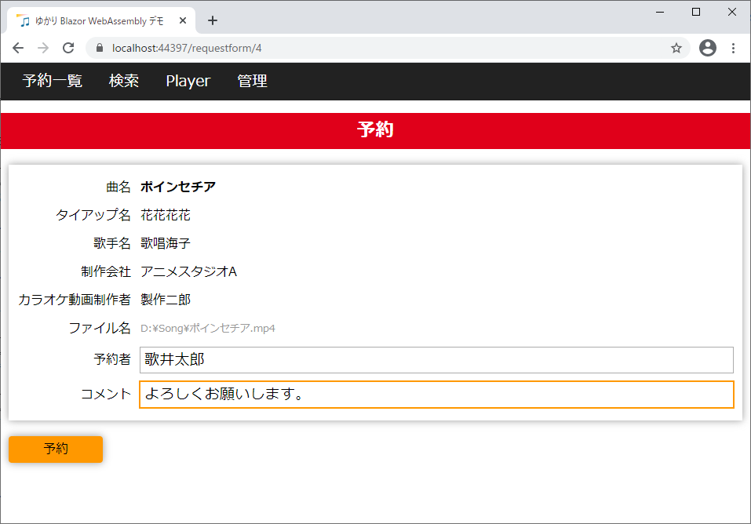
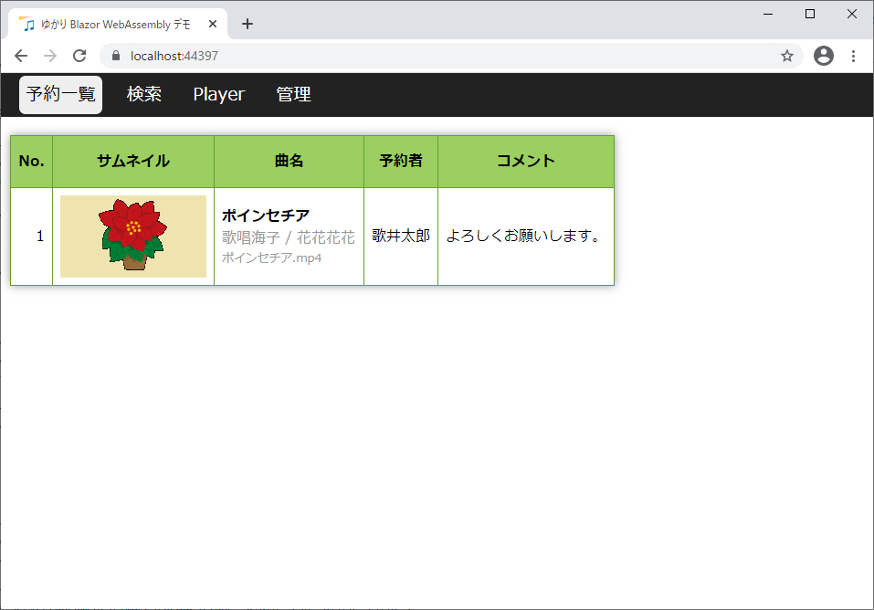
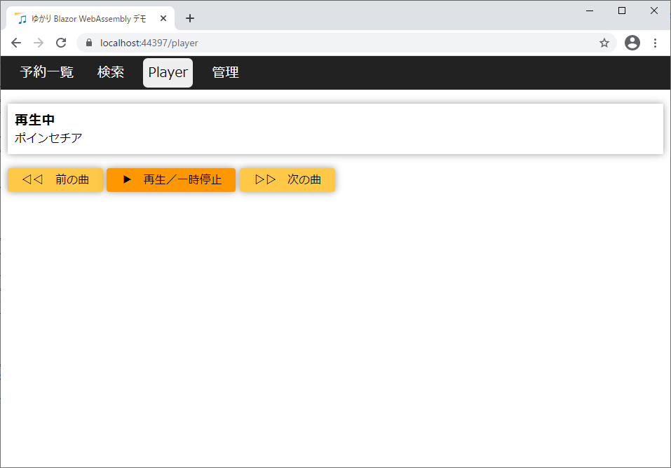
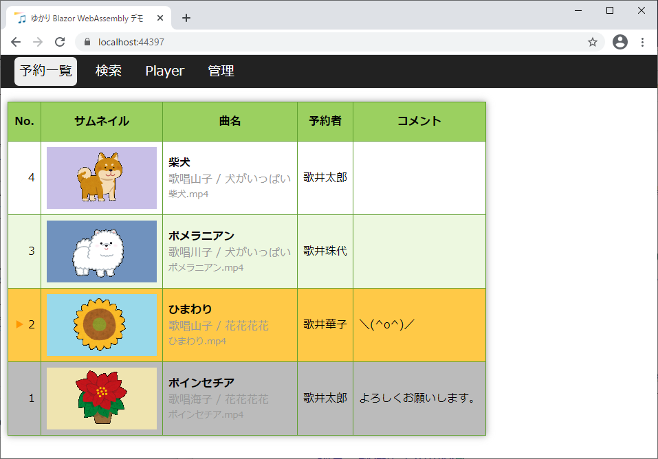
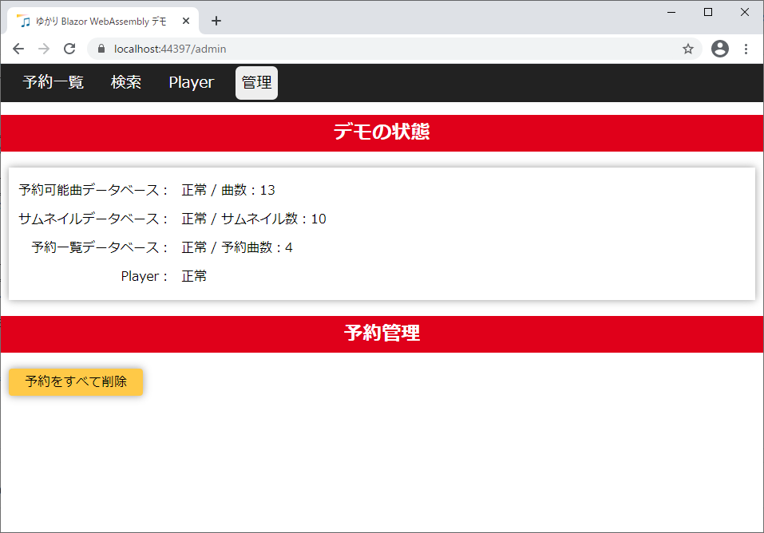

# ゆかり Blazor WebAssembly デモとは？

カラオケ動画をブラウザ上でリクエストをするためツール「[ゆかり](https://github.com/bee7813993/KaraokeRequestorWeb)」が Blazor WebAssembly 化したらこんな感じになるのではないか、なったらいいな、という妄想デモです。

# 動かし方

「ASP.NET と Web 開発」ワークロードをインストールしてある Visual Studio 2019 でソリューションを開き、F5 キーでデバッグ実行すると、ブラウザでデモが動きます。

デバッグ実行時、ブレーク機能を使いたい場合は、ブラウザを Chrome にする必要があります。

Visual Studio 16.8.3 現在、Blazor WebAssembly アプリを何度かデバッグ実行していると、ブラウザが立ち上がらない現象が発生することがあります。その場合は Visual Studio をいったん閉じた後、タスクマネージャーでゾンビになっている Visual Studio を終了してから、再度 Visual Studio を起動すると治ります。

リリースして IIS 下で実行したい場合は YukariBlazorDemo.Server プロジェクトを publish フォルダーに発行します。その後、SampleDataImage フォルダーを publish フォルダー直下にコピーします。

#### 参考リンク
- [Visual Studio で Blazor](https://shinta0806be.ldblog.jp/archives/10326652.html)
- [Blazor WebAssembly アプリ（ASP.NET Core hosted）をフォルダーに発行する](https://shinta0806be.ldblog.jp/archives/10329623.html)

# 使い方

## 予約ゼロ

起動直後は予約一覧ページが表示されますが、まだ曲を予約していないので、内容がありません。
 

## 検索

上部メニューから「検索」をクリックして、検索ページを表示します。

「なんでも検索」タブが表示されており、ここにキーワードを入力して「検索」ボタンをクリックすることで、動画を検索できます。

> このデモでは実際の動画は検索できず、サンプルデータとして登録されているダミーの動画を検索することになります。

 

例えば「花」でなんでも検索すると、曲名・タイアップ名・歌手名など、何らかの名前に「花」が含まれる動画が検索できます。

キーワードをスペースで区切って複数入力すると、AND 検索できます。例えば「花 チ」でなんでも検索すると、「花」と「チ」の両方が含まれる動画が検索できます。

検索結果ページはタブが 2 段並んでいますが、上段のタブでキーワードの対象を切り替えることができます。

「曲名」タブをクリックすると、曲名に「花」を含む動画だけを検索することができます。タイアップ名・歌手名も同様です。

下段のタブで検索結果をソートできます。

デフォルトでは「新着順」（動画の更新日が新しい順）に並んでいますが、曲名順・歌手名順・サイズ順（動画のファイルサイズが大きい順）にソートすることができます。

 

検索ページの「詳細検索」タブでは、複合検索ができます。

 

例えば、「タイアップ名」に「花」、「歌手名」に「海」を指定して検索することで、「タイアップ名」に「花」を含み、かつ、「歌手名」に「海」を含む動画だけを絞り込んで検索できます。
 

## 予約

検索結果ページで歌いたい曲の曲名をクリックすると、予約ページが表示されます。

 

予約者として自分の名前を入力し、必要に応じてコメントも入力してから「予約」ボタンをクリックすると、その曲を予約することができます。
 

## 再生

Player ページでは、予約した曲を再生します。

 

最初は曲が再生されておらず、「停止中」と表示されていますが、「再生／一時停止」ボタンをクリックすると、予約した曲を再生できます。

「前の曲」「次の曲」ボタンで、再生する曲を変更できます。

 

予約一覧ページを表示すると、再生中の曲が橙色で表示されます。

> このデモでは実際の動画は再生されず、予約一覧ページでの表示のみとなります。

 

## 管理

管理ページでは、デモの状態が表示されます。

ここにエラーと表示されている場合は、何らかの障害が発生しています。

「予約をすべて削除」ボタンをクリックすると、予約をすべて削除できます。
 

# 謝辞

感謝です。
- Blazor WebAssembly での開発について、[Blazor WebAssembly (client-side Blazor) アプリケーションプログラミング自習書](https://github.com/jsakamoto/self-learning-materials-for-blazor-jp)で勉強しました。分かりやすい自習書です。
- サンプルデータのサムネイルは[いらすとや](https://www.irasutoya.com/)を使わせて頂きました。

