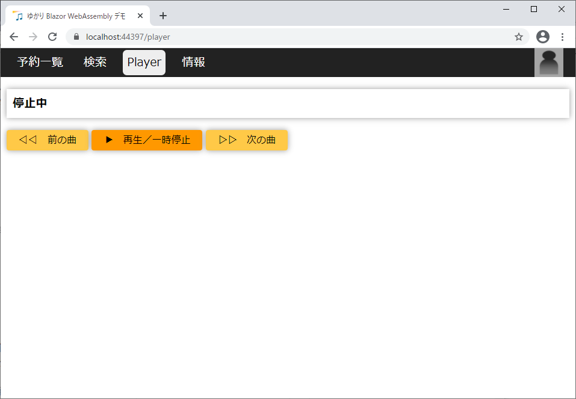
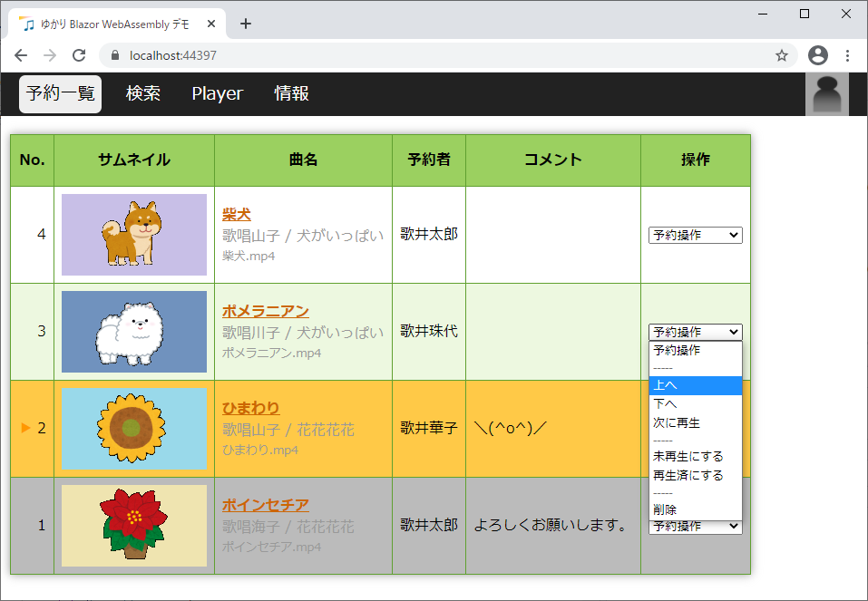
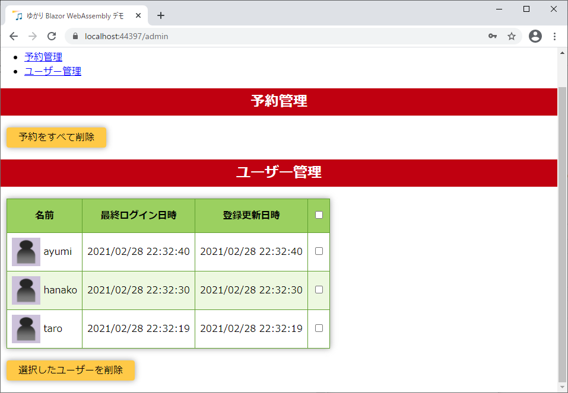

# ゆかり Blazor WebAssembly デモとは？

カラオケ動画をブラウザ上でリクエストをするためツール「[ゆかり](https://github.com/bee7813993/KaraokeRequestorWeb)」が Blazor WebAssembly 化したらこんな感じになるのではないか、なったらいいな、という妄想デモです。

なるべく多くの処理をブラウザ側で行うことにより、サーバーとの通信を低減させ、キビキビと動作します。例えば、検索ページの表示時は一切サーバーと通信しません。検索ボタンをクリックして結果を取得する際に初めて通信します。ただし、初回アクセス時は時間がかかります。

UI は以前から検討事項となっている「シンプルモード」を採用しているため、現行のゆかりの UI とは異なります。言い方を変えれば、シンプルモードの妄想デモにもなっています。

#### 目次

- [起動方法](#起動方法)
- [使い方](#使い方)
- [管理者ユーザーによる管理](#管理者ユーザーによる管理)
- [一般ユーザー](#一般ユーザー)
- [技術的キーワード](#技術的キーワード)
- [謝辞](#謝辞)

# 起動方法

「ASP.NET と Web 開発」ワークロードをインストールしてある Visual Studio 2019 でソリューションを開き、F5 キーでデバッグ実行すると、ブラウザでデモが動きます。

デバッグ実行時、ブレーク機能を使いたい場合は、ブラウザを Chrome にする必要があります。

Visual Studio 16.8.3 現在、Blazor WebAssembly アプリを何度かデバッグ実行していると、ブラウザが立ち上がらない現象が発生することがあります。その場合は Visual Studio と Chrome をいったん閉じた後、タスクマネージャーでゾンビになっている Visual Studio と Chrome を終了してから、再度 Visual Studio を起動すると治ります。

リリースして IIS 下で実行したい場合は YukariBlazorDemo.Server プロジェクトを publish フォルダーに発行します。その後、IIS で publish フォルダーをサイトとして登録します。

#### 参考リンク
- [Visual Studio で Blazor](https://shinta0806be.ldblog.jp/archives/10326652.html)
- [Blazor WebAssembly アプリ（ASP.NET Core hosted）をフォルダーに発行する](https://shinta0806be.ldblog.jp/archives/10329623.html)

# 使い方

## 予約ゼロ

起動直後は予約一覧ページが表示されますが、まだ曲を予約していないので、内容がありません。
 

## 検索

上部メニューから「検索」をクリックして、検索ページを表示します。

「なんでも検索」タブが表示されており、ここにキーワードを入力して「検索」ボタンをクリックすることで、動画を検索できます。

> このデモでは実際の動画は検索できず、サンプルデータとして登録されているダミーの動画を検索することになります。

 

例えば「花」でなんでも検索すると、曲名・タイアップ名・歌手名など、何らかの名前に「花」が含まれる動画が検索できます。

> タイアップ名とは、曲を使用しているアニメやゲーム等の名前です。

キーワードをスペースで区切って複数入力すると、AND 検索できます。例えば「花 チ」でなんでも検索すると、「花」と「チ」の両方が含まれる動画が検索できます。

検索結果ページはタブが 2 段並んでいますが、上段のタブでキーワードの対象を切り替えることができます。

「曲名」タブをクリックすると、曲名に「花」を含む動画だけを検索することができます。「タイアップ名」タブ・「歌手名」タブも同様に、タイアップ名や歌手名に「花」を含む動画だけを検索できます。

下段のタブで検索結果をソートできます。

デフォルトでは「新着順」（動画の更新日が新しい順）に並んでいますが、曲名順・歌手名順・サイズ順（動画のファイルサイズが大きい順）にソートすることができます。

 

検索ページの「詳細検索」タブでは、複合検索ができます。

 

例えば、「タイアップ名」に「花」、「歌手名」に「海」を指定して検索することで、「タイアップ名」に「花」を含み、かつ、「歌手名」に「海」を含む動画だけを絞り込んで検索できます。
 

## 予約

検索結果ページで歌いたい曲の曲名をクリックすると、予約ページが表示されます。
 

予約者を「新規（入力→）」と表示されているドロップダウンリストの右側の欄に入力し、必要に応じてコメントも入力してから「予約」ボタンをクリックすると、その曲を予約することができます。
 

2 回目以降の予約では、自分の名前をドロップダウンリストから選ぶこともできます。
 

## 再生

Player ページでは、予約した曲を再生します。

 

最初は曲が再生されておらず、「停止中」と表示されていますが、「再生／一時停止」ボタンをクリックすると、予約した曲を再生できます。

「前の曲」「次の曲」ボタンで、再生する曲を変更できます。

 

予約一覧ページを表示すると、再生中の曲が橙色で表示されます。

未再生の曲は白または薄緑で表示され、再生済の曲は灰色で表示されます。

> このデモでは実際の動画は再生されず、予約一覧ページでの表示のみとなります。

 

## 予約操作

予約一覧ページの操作列にある「予約操作」ドロップダウンリストにより、対象曲の順番を入れ替えるなどすることができます。

「上へ」「下へ」で対象曲の順番を 1 つずつ移動できる他、「次に再生」で現在再生中の曲の 1 つ上に移動できます。

「未再生にする」「再生済にする」で再生状態を変更できます。

「削除」で予約を取り消せます。

## 情報

情報ページでは、デモの状態が表示されます。

ここにエラーと表示されている場合は、何らかの障害が発生しています。バージョン更新時にエラーが発生した場合は、Server フォルダー（発行した場合は publish フォルダー）直下に生成されている各種 .sqlite3 ファイルを削除して再起動すると解消されるのではないかと思います。
 

# 管理者ユーザーによる管理

## 管理者ユーザーの登録

右上のアイコンをクリックするとポップアップメニューが表示され、「新規ユーザー登録」をクリックすると新規ユーザー登録ページになります。
 

一番初めに登録するユーザーは管理者ユーザーとなります。名前は「admin」で固定です。

パスワードを（確認も含め同じものを）2 回入力して「新規ユーザー登録」ボタンをクリックすると、管理者ユーザーが登録され、管理者ユーザーでログインできます。
 

## ログイン・ログアウト

管理者ユーザーでログインした状態では、右上のアイコンがピンク色になります。

右上のアイコンをクリックするとポップアップメニューが表示され、「ログアウト」をクリックするとログアウトできます。
 

再度、右上のアイコンのポップアップメニューから「ログイン」をクリックするとログインページになります。

「お名前」欄に「admin」、「パスワード」欄にパスワードを入力して「ログイン」ボタンをクリックするとログインできます。
 

## 管理ページ

右上のアイコンのポップアップメニューから「管理ページ」をクリックすると管理ページになります。

「予約をすべて削除」ボタンをクリックすると、現在予約されている曲をすべて削除することができます。

一般ユーザー（管理者以外のユーザー）が登録されている場合は、「ユーザー管理」セクションにユーザー一覧が表示されます。

削除したいユーザーにチェックを入れて「選択したユーザーを削除」ボタンをクリックすると、チェックしたユーザーを削除できます。列ヘッダーのチェックボックスをクリックすると、すべてのユーザーを一気にチェック、またはチェックを外すことができます。

一般ユーザーがパスワードを忘れた場合の救済措置は現時点では存在しません。当該ユーザーをいったん削除した後、改めて、ユーザー登録し直してもらってください。

管理者がパスワードを忘れた場合は、Server フォルダー（発行した場合は publish フォルダー）直下に生成されている UserProfiles.sqlite3 を削除して再起動してください。管理者を含めすべてのユーザーが削除されるので、管理者の登録からやり直してください。
 

# 一般ユーザー

## 一般ユーザーの登録

右上のアイコンをクリックするとポップアップメニューが表示され、「新規ユーザー登録」をクリックすると新規ユーザー登録ページになります。

一番初めに登録した管理者ユーザー以外の登録ユーザーはすべて一般ユーザーとなります。

名前と、パスワードを（確認も含め同じものを）2 回入力して「新規ユーザー登録」ボタンをクリックすると、ユーザーが登録され、ログインできます。

## ログイン・ログアウト

一般ユーザーでログインした状態では、右上のアイコンが紫色になります。

右上のアイコンをクリックするとポップアップメニューが表示され、「ログアウト」をクリックするとログアウトできます。

再度、右上のアイコンのポップアップメニューから「ログイン」をクリックするとログインページになります。

「お名前」「パスワード」欄に入力して「ログイン」ボタンをクリックするとログインできます。 

## マイページ

右上のアイコンのポップアップメニューから「マイページ」をクリックするとマイページになります。 
 

プロフィールセクションでは、プロフィール画像、名前、パスワードの変更ができます。
 

登録ユーザーは検索時、気になる曲を「後で歌う予定リスト」に保存することができ、保存したリストがマイページの後で歌う予定リストセクションに表示されます。

曲名をクリックすると予約できます。

後で歌う予定リストから曲を削除したい場合は、削除したい曲にチェックを入れて「選択した曲を削除」ボタンをクリックします。
 

これまでに予約した曲の一覧がマイ履歴セクションに表示されます。

曲名をクリックすると予約できます。

「マイ履歴をすべて削除」ボタンをクリックすると、マイ履歴をクリアできます。
 

# 技術的キーワード

- Blazor WebAssembly (client-side Blazor / WASM) + ASP.NET Core hosted
- Entity Framework Core + SQLite
- JSON Web Token (JWT / トークン認証) + AuthorizeView
- Server-Sent Events (SSE) + EventSource
- C# 9.0 + nullable
- REST API
- ローカルストレージ (localStorage / Web Storage)
- JavaScript (JS) 相互運用

# 謝辞

感謝です。
- Blazor WebAssembly での開発について、[Blazor WebAssembly (client-side Blazor) アプリケーションプログラミング自習書](https://github.com/jsakamoto/self-learning-materials-for-blazor-jp)で勉強しました。分かりやすい自習書です。
- サンプルデータのサムネイルは[いらすとや](https://www.irasutoya.com/)を使わせて頂きました。

